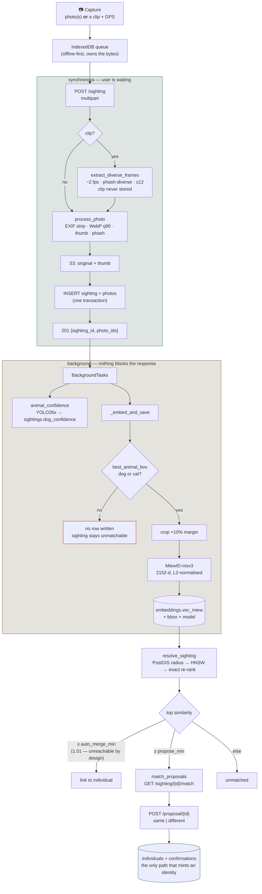

# AGENTS.md

Orientation for AI coding agents working in this repo. Vendor-neutral companion
to `CLAUDE.md`.

**Read first, in this order:**

1. **`CLAUDE.md`** — the working agreement (who owns product vs technical
   decisions, and the "surface decisions, not code" reporting style). It governs
   *how* to report; this file covers *what is here*.
2. **`build-foundations.md`** — stack, architecture principles, data model,
   north star. Note §5 predates the implementation; see [Deltas](#deltas-from-build-foundationsmd).
3. **`docs/specs/`** — design specs. Current build: IndieDex MVP.
4. **`docs/OPERATIONS.md`** — deploy, testers, flags. Gitignored (public repo).

---

## The pipeline

Verified end to end on real uploads: two sightings of the same dog scored
0.4003, a different dog 716 m away scored 0.1197, one proposal was raised, and a
`same` verdict created the individual and linked both sightings.

**No score merges anything on its own.** `reid_auto_merge_min` is 1.01 —
deliberately unreachable — so every identity comes from a human verdict. The
measurements below say that is not conservatism, it is the only defensible
setting at this data density.

---

## ML subsystem

| Module | Model | Runtime | Cost | Job |
|---|---|---|---|---|
| `app/detect_reid.py` | YOLO26x (ONNX, NMS baked in) | onnxruntime CPU | ~314 ms | animal box + dog/cat confidence |
| `app/embed.py` | MiewID-msv3 (ONNX) | onnxruntime CPU | ~170 ms | 2152-d identity vector |
| `app/detect.py` | YOLOv8n (ONNX) | onnxruntime CPU | ~27 ms | **superseded**, no live callers |

**There is no torch anywhere, and there must not be.** The service runs ONNX
Runtime on CPU. Models are exported on a machine that has torch, via
`scripts/export_miewid_onnx.py` and `scripts/export_yolo26x_onnx.py`.

**The weights are gitignored** (206 MB + 223 MB) and are *not* fetched by the
Dockerfile. Consequences an agent must not trip over:

- A fresh clone has no weights. `_get_session()` raises `ModelUnavailable` /
  `DetectorUnavailable` naming the script to run.
- Model-dependent tests **skip** rather than fail when weights are absent, so a
  green suite does not prove the models work. Check for `skipped` in the output.
- **Deploying as-is silently disables `dog_confidence` in production** — the
  background task catches the error and the sighting still saves. See
  [Before deploying](#before-deploying).

**Licences** (`backend/app/ml/NOTICE.md`): YOLO is AGPL-3.0; **MiewID-msv3
declares no licence at all**. Both are unresolved for a public launch.

---

## Local development

The dev stack is `docker-compose.dev.yml` (Postgres+PostGIS+pgvector, MinIO).
Ports collide on some machines — override in an untracked
`docker-compose.dev.local.yml`, and note Compose **appends** `ports` lists, so
the override needs `ports: !override` or the original binding remains.

Two things that will waste an hour if you don't know them:

**Storage has two endpoints, on purpose.** `s3_endpoint` is where the server
writes; `s3_public_endpoint` is what presigned URLs are signed against
(defaults to the same). SigV4 signs the host, so a URL signed for the internal
host returns 403 when a browser on a different host fetches it. Needed for
dev-over-LAN and for any CDN in front of S3.

**Tests inherit `backend/.env`.** If it points `S3_PUBLIC_ENDPOINT` at a
self-signed host, `test_storage.py` fails on certificate verification. Run with
`S3_PUBLIC_ENDPOINT= uv run pytest`.

Serving to a phone needs HTTPS: mobile browsers refuse `navigator.geolocation`
outside a secure context, so plain `http://192.168.x.x` yields captures with
`geo_source=none`.

---

## Measured, do not re-litigate

Numbers from a 47,671-frame sweep over 21 encodings (see the `research` repo).
Change these only with new measurements, not intuition.

- **WebP q90 for stored photos.** −0.2 accuracy points vs lossless, 66% smaller
  than the previous JPEG q95 on a real 12 MP capture (674 kB vs 2001 kB).
- **Never re-encode at q100.** On already-compressed sources it *inflated* files
  9.1 kB → 26.3 kB for zero measurable gain.
- **JPEG collapses below ~15 kB; WebP degrades gracefully.** At matched size,
  WebP q30 scored 0.930 against JPEG q10's 0.825.
- **YOLO26x over YOLOv8n for anything re-ID.** On 29 varied photos: dogs 14/17
  vs 9/17, cats 10/12 vs 1/12. The old gate scored a clearly visible dog at
  0.021 where YOLO26x gives 0.800.
- **Preprocessing is load-bearing.** MiewID needs resize-shorter-side-to-440 then
  centre-crop, matching torchvision. Squashing to 440×440 silently shifts every
  embedding away from the distribution the thresholds were measured on.
- **Compression damages calibration before it damages ranking.** Across the
  quality sweep, top-1 barely moved while d′ fell 4.58 → 3.34. Any similarity
  threshold is tied to the encoding it was calibrated on.
- **Re-ID accuracy is governed by how many photos of that dog are already
  stored.** 30 sightings of 10 dogs, session-disjoint, queried through this API:

  | prior photos of the dog | 1 | 2 | 4 | 8 | 32 | 64 | 4,767 |
  |---|---|---|---|---|---|---|---|
  | top-1 | 37% | 43% | 67% | 83% | 87% | 87% | 94.9% |

  The 94.9% in the research repo is a 47,671-frame-gallery number. **A dog with
  one prior photo is a ~40% problem.** Do not quote 94.9% as what a new
  contributor will experience.
- **More photos improve ranking, never separation.** d′ held flat at ~0.85 across
  every gallery size above (genuine ≈0.35, impostor ≈0.245). Proposal precision
  stayed 18–36% at *every* cut-off from 0.20 to 0.50. Collecting more data will
  not rescue a fixed threshold — only a human looking at a ranked candidate will.
- **This pipeline is faithful to the research one.** On identical frames, this
  API (WebP q90 + YOLO26x) scored 50% top-1 against the offline path's 46.7%
  (lossless PNG + YOLOv8n box). Gaps to benchmark numbers are the gallery, not
  the service.

---

## Open questions

**Every threshold number here came from a lab dataset and expires.** The
measurements are all from the Dognosis v2 clips: 10 dogs, one indoor
scent-detection room, constant background and lighting, fixed cameras, animals
in harnesses, and a population skewed to a few breeds — which is exactly why
look-alikes dominate it. Street sightings vary in background, light, distance
and angle, and free-roaming indies vary far more in coat and size than a kennel
of beagles, while the population is much larger. Those pull in opposite
directions and neither is measured.

**Recalibrate weekly as real verdicts arrive.** `confirmations` gives the label
and `match_proposals.score` gives what the model said; fitting the threshold is
a query over those two, not a new experiment. Treat `reid_propose_min` as a
placeholder until it has been fitted at least once on real data.

**Match thresholds are unset, deliberately**, and the measurements above suggest
a *threshold* is the wrong control surface. At d′ ≈ 0.85 no cut-off separates
same-dog from different-dog: 0.25 gave 18% proposal precision, and 0.50 gave 36%
while losing 71% of true matches. `propose_min` currently admits up to 5
candidates per sighting, which on this data is ~4.8 proposals per upload — review
fatigue for almost no signal.

Proposing the **top-1 candidate only**, regardless of absolute score, is the
change worth making: one question per sighting instead of five, at similar
precision. That is a product call about how much reviewer time a sighting is
worth, so it is Akash's. Fit any number to real verdicts in `confirmations`; do
not port numbers from the research repo.

**Ask for more frames when a match is ambiguous.** The single largest lever
measured is frames per individual — 1 → 8 frames takes top-1 from 37% to 83%,
far more than any threshold or encoding change. This is the strongest argument
for the deferred video capture, and for prompting a contributor for a second
angle when the top candidates cluster.

**Cats.** `detect_reid` embeds dogs *and* cats (COCO 15+16). Whether cats are in
scope is a product decision.

**Video capture is now in** — PR #3's two commits cherry-picked, its capture
screen rebuilt on the current multi-photo component. **Do not try to merge
`feat/video-capture`**: it predates the history rewrite and shares no common
ancestor with `main`.

Frame selection still uses phash, which compares whole scenes rather than the
animal; embedding-space diversity would be better now that the embedder is
in-tree, and sampling the middle 80% of a clip would help (detection is 93%
mid-clip vs ~39% at the edges).

---

## The connection pool is shared with the background tasks

`asyncpg.create_pool` defaults to `max_size=10`, and this pool has two very
different consumers: request handlers, which hold a connection for the whole
request through the `get_conn` dependency, and the background tasks that embed
and match after the response. Concurrent uploads exhausted it.

Measured: 16 uploads at once, **exactly 10 served and 6 never handed to the app
at all** — they sat suspended on `pool.acquire()` until the client gave up at
90 s. With `db_pool_max = 30`, all 16 return 201 in ~1.7 s.

The reason this took so long to find: **a suspended coroutine has no thread
stack**, so `faulthandler` dumps showed only idle worker threads and no
application frames. Every observation said "the server is idle" while six
requests hung, which reads like a deadlock and is not one. If something similar
appears again, count the served requests first — a number that matches a pool or
limiter size is the whole answer.

`backend/sitecustomize.py` (untracked, local) registers a SIGUSR1 stack dump:
`kill -USR1 <uvicorn pid>`. Start uvicorn with `PYTHONPATH=.` or it is never
imported — a console script puts `.venv/bin` on `sys.path`, not the cwd.

---

## Before deploying

**`main` deploys straight to production.** `.github/workflows/deploy.yml` fires
on every push to `main`, SSHes to the box, `git pull` + `docker compose up
--build`, then checks the site returns 200. There is **no staging and no CI test
run** — the 200 check proves the app boots, not that it works.

So merging is deploying. Before any merge touching the ML path:

- [ ] **Model weights reach the box.** They are gitignored and the Dockerfile
      does not fetch them, so `git pull` will not bring them. Without this the
      background tasks catch `ModelUnavailable` and every upload saves with no
      embedding: re-ID appears deployed and does nothing.
- [ ] Box RAM fits ~430 MB of resident model weights plus runtime.
- [ ] **Backfill existing photos** — `uv run python scripts/backfill_embeddings.py
      --resolve` from `/app/backend`. Nothing embeds them automatically, and
      `find_candidates` filters on `vec_miew IS NOT NULL`, so until this runs the
      whole existing corpus is invisible to matching. Given that accuracy tracks
      gallery density, skipping it starts the system at its worst point.
- [ ] Licence position settled for anything shipped in a public artifact.
- [ ] `S3_PUBLIC_ENDPOINT` correct for the environment.
- [ ] Note that `dog_confidence` is not comparable across this deploy: existing
      rows were scored by YOLOv8n, new ones by YOLO26x.

---

## Deltas from `build-foundations.md`

§5 was written before implementation and no longer matches:

| §5 says | Actually |
|---|---|
| MegaDescriptor / DINOv2 | **MiewID-msv3**, 2152-d |
| `sightings.embedding` column | **`embeddings` table**, one row per (photo, model) |
| `<=>` on the vector column | `vec_miew::halfvec(2152)` — pgvector HNSW caps at 2000 dims, MiewID is 2152 |
| geo prior ~300 m | `find_candidates` defaults to a caller-supplied radius; 2 km used in testing |
| species filter | not implemented; `detect_reid` returns the COCO class but it is not persisted |

Treat this table as the current truth and §5 as intent.
