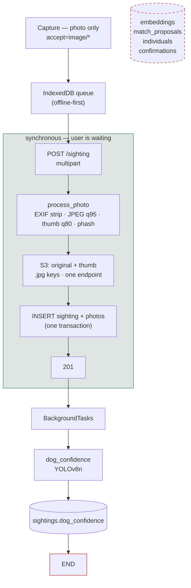
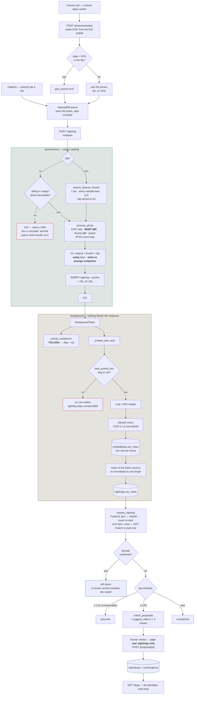

# Capture workflow: before and after re-ID

What one photo upload did at `cf276c4`, what it does now, and why each change
was made. Companion to `AGENTS.md` (which describes the current system only).

---

## Before



The four tables on the right existed from migration `0001`. **No committed code
had ever written a row to any of them.** A photo went in, received a
dog-confidence score, and stopped. There was no embedding, no candidate search,
no notion of an individual animal.

---

## Now



---

## Stage by stage

| Stage | Before | Now | Why |
|---|---|---|---|
| Capture | `accept="image/*"` | **photo(s) or a short clip** | Frames per individual is the biggest measured lever: 1 → 8 frames takes top-1 from 37% to 83% |
| Encode | JPEG q95 / thumb q80 | **WebP q90** / thumb q80 | −0.2 accuracy points, 66% smaller (674 kB vs 2001 kB on a 12 MP capture) |
| S3 keys | `.jpg` | `.webp` | Old objects keep their keys and formats; both coexist |
| S3 endpoint | one | **write vs presign split** | SigV4 signs the Host, so a URL signed for the internal host 403s in a browser |
| Animal gate | YOLOv8n | **YOLO26x**, dog *and* cat | v8n scored a clearly visible dog at 0.021 where 26x gives 0.800 |
| Embedding | none | **MiewID-msv3**, 2152-d, on the animal crop | Whole-frame embeddings match other streets, not other dogs |
| Candidate search | none | PostGIS 1 km → HNSW → exact re-rank | HNSW caps at 2000 dims; MiewID is 2152, so ANN runs on a `halfvec` cast and the shortlist is re-scored at full precision |
| Identity | none | human verdict only, **on your own sightings** | You decide about photographs you took; a stranger has only the pixels. Cross-observer pairs stay pending for an adjudicator (#29) |
| Clip | discarded after extraction | **kept in S3** (`sightings.clip_s3_key`) | Once the frames were chosen the clip was gone, so a better model could never re-read the footage |
| Frame sampling | 2 fps, phash-diverse | **1 fps, every sample kept** | Dedup at hamming 8 discarded frames a second apart: a 5s clip of a sitting dog yielded ONE frame, so "average of five" averaged one vector |
| Query vector | every frame, max over them | **mean of the frames**, per sighting | Frames from one clip are one view sampled repeatedly; their mean is that view with the noise averaged out |
| Bad input | 500 | **422** | The offline queue treats 5xx as retryable and *breaks* its drain — one corrupt photo stopped every sighting behind it syncing, forever |
| Coordinates | stored as given | **range-checked** | `geography(Point,4326)` wraps rather than rejects: lat=999 was silently stored as −81.0, a real place in Antarctica |
| Basemap | OSM raster | CARTO Positron / Dark Matter | Road-atlas detail competed with the sightings |
| Pins | square | round | Matches the cluster bubbles |

---

## Thresholds, and why nothing merges itself

`reid_auto_merge_min` is **1.01** — deliberately unreachable. Every identity in
the system comes from a person saying "same dog".

That is not caution, it is what the data supports. Measured on 30 sightings of
10 dogs pushed through this API, session-disjoint:

| prior photos of the dog | 1 | 2 | 4 | 8 | 32 | 64 | 4,767 |
|---|---|---|---|---|---|---|---|
| top-1 | 37% | 43% | 67% | 83% | 87% | 87% | 94.9% |

Two things follow:

**94.9% is a dense-gallery number.** It is the research repo's figure over a
47,671-frame gallery. A dog with one prior photo is a ~40% problem. Do not quote
94.9% as what a new contributor will experience.

**d′ stayed flat at ~0.85 across every gallery size** (genuine ≈0.35, impostor
≈0.245). More photos improve *ranking* — the odds that some stored frame of the
right dog is nearest — and never improve *separation*. Proposal precision was
18–36% at every cut-off from 0.20 to 0.50. No amount of collected data rescues a
fixed threshold; only a human looking at a ranked candidate does.

The pipeline is faithful to the offline research path — on identical frames this
API scored **50%** top-1 against the offline path's **46.7%**. Gaps to benchmark
numbers are the gallery, not the service.

### These numbers came from a lab, and expire

Everything above was measured on the **Dognosis v2** clips: 10 dogs in a single
indoor scent-detection room — constant background, constant lighting, fixed
camera positions, animals in harnesses, and a population skewed to a few breeds.
That last part is why look-alikes dominate: several beagles, several black labs.

Street sightings share none of it. Background, light, distance, angle and
weather all vary; free-roaming indies vary far more in coat, markings and size
than a kennel of beagles; and the population is far larger, so look-alikes are
rarer per pair but more numerous overall. Those pull in opposite directions and
**neither has been measured**.

So `reid_propose_min` is a placeholder shaped by a lab dataset, not a property
of MiewID or of dogs. **Recalibrate as real verdicts arrive.**

It now sits at **0.50**, lowered from 0.71 once merging had a surface. 0.71 was
not conservative, it was off: it sat *above* the best score any genuine pair
ever reached (0.5532), so no true match could clear it and the review queue was
empty by construction. 0.50 is the best precision on the measured curve — 22
prompts at 36.4% — and still surfaces about two wrong pairs for every right one,
which is why the reviewer is asked *"same dog?"* rather than told.

A test pins the property that made 0.71 useless: `propose_min` must stay below
the best observed true match, so the same mistake fails loudly instead of
presenting as a queue nobody can explain the emptiness of.
The inputs already exist and no new experiment is needed:

| what | where |
|---|---|
| the label | `confirmations.verdict` (`same` / `different`) |
| what the model said | `match_proposals.score` for that proposal |
| how much evidence | count of `embeddings` per sighting |

Join those, plot the two distributions, and pick the operating point you want on
the precision/recall curve. Until that has been done at least once on real
verdicts, treat the current default as a starting position rather than evidence.

---

## What a photo becomes

The synchronous half runs while the contributor waits, so it does only what the
201 depends on. Everything that can be deferred is.

| step | where | notes |
|---|---|---|
| recognise a retry | `routes/sighting.py` | `client_token` — a repeat returns the original sighting, see below |
| range-check lat/lng | `routes/sighting.py` | before PostGIS, which **wraps** rather than rejects — lat=999 was stored as −81.0, a real place in Antarctica |
| decode + strip EXIF | `process_photo`, off the event loop | an unreadable file is a **422, never a 500** — see below |
| WebP q90 + 512px thumb + phash | same | one full-resolution original, one tile |
| upload both | S3 | write endpoint; presigning uses the public one, since SigV4 signs the Host |
| INSERT sighting + photos | Postgres | 201 returns here |
| `animal_confidence` | background | YOLO26x, a label not a gate |
| `_embed_and_save` | background | crop → MiewID → `embeddings`, then the mean |
| `resolve_sighting` | background | once, here — `GET /match` stays a pure read |

### Why one capture cannot become two sightings

`POST /sighting` takes a `client_token`, minted once when the capture is queued
and resent unchanged on every attempt. A repeat returns the original sighting
instead of creating another.

Without it, duplicates were routine rather than rare. The offline queue deletes
a queued item only *after* the response arrives, so a request that landed but
whose response was lost — signal dropped mid-upload, phone asleep — stayed
pending and was posted again. Measured on production before the fix: **12
duplicated captures across 47 sightings, 22 extra rows.** The copies arrived
3–17 hours after the originals, which is a queued item waiting for signal, not
a double tap.

Two details that matter:

**Unique per observer, not globally.** The index is
`(observer_id, client_token)`, matching the lookup, which is scoped by observer
so a guessed or replayed token cannot return someone else's sighting. A global
index with a scoped lookup disagrees with itself and 500s.

**Not deduplicated on `phash`.** Identical bytes are not the same event — two
frames of one clip share almost everything, and a person may legitimately log
the same photo twice. What must be caught is "this is a retry of *that
request*", a property of the request rather than of the pixels.

The pre-check is an optimisation; the unique index is the guarantee. Two flushes
racing — an installed PWA and a browser tab over one shared IndexedDB — can both
pass the pre-check, and the `UniqueViolationError` path is where the loser
returns the winner's sighting.

`scripts/find_duplicate_sightings.py` reports what the gap already left behind.
Read-only, and dispatchable as the *Find duplicate sightings* workflow.

---

### Why a bad photo must not 500

`offline/queue.ts` classifies 4xx as permanent and 5xx as retryable, and its
drain **breaks** on a retryable failure rather than skipping the item:

```js
// Retryable (network failure or 5xx): stop here, try the rest later.
break;
```

So an unhandled `UnidentifiedImageError` — a truncated file, an odd format —
did not merely produce an ugly error. It **stopped the whole queue**, and every
sighting behind it never synced, on every retry, indefinitely. In the field that
is silent data loss presented to the user as "couldn't sync".

A 422 is a permanent failure the queue sets aside so it can move past. That is
also why a multi-photo post with one bad file is rejected whole rather than
half-stored: a sighting is one observation, and a partial save leaves a record
whose evidence is missing without saying so.

### Why a human verdict is never overwritten

`resolve_sighting` returns early for a sighting whose `match_status` is already
`confirmed`. It used to rewrite whatever it found, so a re-run that no longer
proposed anything set `individual_id = NULL` and `match_status = 'unmatched'` —
silently erasing the decision.

That is reachable, not theoretical: `backfill_embeddings.py --resolve` re-runs
resolution over existing sightings, and it is exactly what you run after a model
or threshold change — both of which move scores, which is the trigger. Since
`auto_merge_min` is deliberately unreachable, a human verdict is the *only* way
a sighting becomes `confirmed`, so this destroyed the scarcest data in the
system: the labelled pairs the thresholds are meant to be fitted against.

Only `confirmed` is frozen. A pending proposal is still the model's opinion, and
re-running is how it gets updated.

---

## Video capture

For a long time there was no video option because PR #3 (`feat/video-capture`)
was never merged — and **it cannot be merged**: that branch was cut before the
repository's history was rewritten, so it shares no common ancestor with `main`
(different root commit, and it carries only migration `0001`). GitHub will never
offer a clean merge for it.

Its two commits are cherry-picked here instead. `app/video.py` decodes a clip
with `imageio` + `imageio-ffmpeg` (a bundled static binary, so the slim
container needs no apt package), subsamples to **1 fps**, runs each frame
through the ordinary `process_photo`, and keeps **every sample**, capped at 12.
The clip is **kept in S3** alongside them, so a better detector or a newer
embedding model can be re-run over the original footage. Its key lives on
`sightings.clip_s3_key`.

Both of those defaults were changed once frames started being averaged, and the
dedup one is the non-obvious half. `phash_hamming_min` was 8, which discarded
any frame within 8 hamming of one already kept — and frames a second apart from
a steady clip are far closer than that. Measured: **a 5-second clip of a sitting
dog yielded exactly one frame**, so "the average of five" averaged one vector.
That filter was right when frames were only ever stored as separate photos and
near-duplicates were waste; it is wrong when they feed a mean, where repeated
samples of the same instant are precisely what cancels the noise. The parameter
survives for any path that wants distinct views instead.

The capture screen's half of that branch was discarded rather than merged: it
predates the multi-photo refactor from PR #6 and conflicted in eight places
against a component that no longer exists in that shape. The video option was
rebuilt on the current screen instead, including the offline queue, which now
reads a clip's bytes at capture time exactly as it does for photos — a camera
video File on iOS is the same purgeable handle, only larger.

Measured live on a 2.8 s, 30 fps clip: 201 in 0.7 s, 6 diverse frames stored,
5 embedded (one frame had no animal in it, correctly skipped),
`dog_confidence` 0.969, `attrs.source = "video"`.

**Matching had to change to make video worth anything.** `resolve_sighting`
originally queried with a sighting's *first* embedding, so a six-frame clip
searched with one frame and the other five were dead weight on the query side.
On that live clip the single-frame query ranked the wrong dog first and the
right dog fourth; querying with all six put the right dog first **and** second:

| | top candidate | rank of the true dog |
|---|---|---|
| first frame only | cheetah 0.4158 | 4th (0.3052) |
| max over 6 frames | **luna 0.5401** | **1st and 2nd** |

`find_candidates` now takes every embedding of the query sighting, runs one
indexed ANN probe per frame, and scores each candidate by its best match against
any frame. A candidate is the same animal from a different angle; the question
is "have we seen this dog", not "have we seen this pose".

One correction still outstanding: frame selection uses **phash**, which compares
whole scenes. Two frames of the same dog against the same wall look
near-identical to phash while differing usefully in embedding space. Selecting on
embedding diversity would be better now that the embedder is in-tree. Sampling
the middle 80% of the clip would help too — detection succeeds 93% mid-clip
against ~39% at the edges.

---

### What a clip becomes

For a 5-second recording, end to end:

| step | result |
|---|---|
| sampled at 1 Hz | 5 frames |
| `process_photo` each | 5 WebP originals + thumbs in S3 |
| clip itself | `sightings/<id>/clip.mp4`, key on the row |
| `best_animal_box` per frame | frames with no animal are skipped, not embedded whole |
| MiewID per surviving frame | 5 × 2152-d unit vectors in `embeddings` |
| mean, re-normalised | one vector on `sightings.vec_miew` |
| `resolve_sighting` | queries with the mean, falls back to per-frame if absent |

Verified live: 5 frames, 5 vectors, clip present in S3, mean at unit norm
matching a recomputed mean to 1.000000, each frame 0.986–0.993 from it. That
last spread is the per-frame noise the average removes.

Two things the mean is **not**. It is not equivalent to five photos — the
37%→83% top-1 gain comes from more independent *views* in the gallery, and five
frames a second apart are one view sampled five times. And it is not the right
operation one level up: two sightings days apart are genuinely different views,
so `routes/dogs.py` compares two dogs by the **max** over their photo pairs and
carries a test that fails if anyone switches it to a centroid. Same arithmetic,
opposite conclusion, because the scope differs.

Averaging also cost one thing that had to be fixed separately: `suggest_video`
counted the *query* vectors to decide whether evidence was thin, and the mean
reduces five frames to one — so every clip looked thin and the app would have
asked someone who had just filmed five seconds of a dog to film a clip. It now
counts the sighting's embedded frames.

---

## What existing data does on deploy

**Schema migrates itself.** `deploy/entrypoint.sh` runs `alembic upgrade head`
before uvicorn, and it is `set -e` — so a migration failure means the app never
starts rather than starting against the wrong schema. pgvector comes from the
`pgvector/pgvector:pg16` image (0.8.6; `halfvec` needs ≥0.7.0). Head is
currently `0009`: `0008` adds `sightings.clip_s3_key` and `sightings.vec_miew`,
`0009` adds `sightings.client_token` with a per-observer unique index.
Every added column is nullable, so no backfill is needed for correctness.

**S3 needs nothing.** Format is per-object and the key lives in `photos.s3_key`.
Existing `.jpg` objects keep serving; only new uploads are `.webp`.

**Existing photos need a backfill, and there is a script and a workflow for
it.** Run it from the *Backfill embeddings* workflow (manual dispatch,
`dry_run` defaults true) or directly:
`backend/scripts/backfill_embeddings.py`. Nothing embeds them automatically, and
`find_candidates` filters on `vec_miew IS NOT NULL`, so until it runs the whole
existing corpus is invisible to matching — which, given that accuracy *is*
gallery density, starts the system at the 1-photo-per-dog end of the table above
while the photos that would fix it sit unread in S3.

```
uv run python scripts/backfill_embeddings.py --dry-run   # count first
uv run python scripts/backfill_embeddings.py --resolve   # embed, then match
```

Serial by design: embedding is CPU-bound ONNX on the same box that serves
requests, so a parallel backfill would compete with live uploads for cores
(`--sleep` throttles it further). Resumable — it only selects photos with no
vector and upserts on `(photo_id, model)`, so interrupting it loses at most the
photo in flight. One quirk: a photo with no detectable animal gets no row at all
(a whole-frame vector would pollute candidate search), so it is re-examined on
every run and the pending count never reaches zero on a corpus with dogless
photos. That is deliberate — those should be retried after a detector upgrade.

Run on production 2026-08-31 after the re-ID deploy: **19 photos pending,
embedded 0, no animal 19, 0 sightings affected**. The corpus was already fully
embedded — every remaining candidate is a photo YOLO26x sees no animal in, which
is exactly the case that never clears. Nothing to recover.

A real run passes `--resolve`, so it re-decides matching as well as embedding.
That was unsafe until the guard described under *Why a human verdict is never
overwritten* landed: on a corpus with confirmed dogs it would have unlinked
them.

**`dog_confidence` becomes incomparable across the deploy** — old rows scored by
YOLOv8n, new rows by YOLO26x, and the two disagree substantially (on 29 varied
photos: dogs 14/17 vs 9/17, cats 10/12 vs 1/12). Any filter on that column will
treat two different populations as one.

**A failed migration would take the site down**, not merely leave it un-updated:
`entrypoint.sh` is `set -e`, so a migration error means uvicorn never starts and
the replaced container is already gone. Both new migrations add `CHECK`
constraints, which Postgres normally validates against every existing row. Both
are therefore declared **`NOT VALID`**: new and updated rows are still enforced,
the scan is skipped, and no pre-existing data can abort the boot. Validate them
deliberately later, under a lock that does not block writes:

```sql
ALTER TABLE embeddings      VALIDATE CONSTRAINT ck_embeddings_miew_vec;
ALTER TABLE match_proposals VALIDATE CONSTRAINT ck_match_proposals_has_target;
```

**The models are fetched on boot.** They are gitignored and not baked into the
image, so `git pull` never brings them and a fresh container has none — in which
case both ML tasks raise, get caught, and every upload saves with no embedding:
re-ID looks deployed and does nothing. `entrypoint.sh` now runs
`scripts/fetch_models.py` first, pulling the pre-exported ONNX from object
storage onto a named volume, so it happens once per box rather than once per
deploy. Deliberately non-fatal — a fetch failure should degrade re-ID, not take
the site down — so the state is reported instead:

```
GET /health  →  {"status":"ok","reid":"ready"|"degraded","models":{...}}
```

Seed the bucket once from a machine that has run the export scripts:
`uv run python scripts/fetch_models.py --upload`.

Baking the weights into the image was rejected: ~430 MB on every deploy, and
MiewID declares no upstream licence, which makes shipping it inside a
distributable artifact an open question. Exporting on the box is impossible by
design — that needs torch, which the runtime image deliberately excludes.

---

## Local development ports

Every default port collided on the machine this was built on, so the local stack
runs remapped. **No committed default changed** — see `AGENTS.md` for the table
and where each override lives (`docker-compose.dev.local.yml`, `backend/.env`,
`frontend/vite.config.local.ts`, all gitignored). In short: Postgres 5433, MinIO
9002/9003, API 8099, Vite 5174 over HTTPS for phone testing.

Two traps in there: Compose *appends* `ports` lists, so an override needs
`ports: !override` or the original binding survives and still collides; and the
API port has to match the Vite proxy target, because the frontend proxies
server-side rather than from the browser.

---

## Concurrency

The connection pool is shared by request handlers, which hold a connection for
the whole request via the `get_conn` dependency, and by the background tasks
that embed and match after the response. asyncpg defaults to `max_size=10`,
which is not enough for both: 16 concurrent uploads produced exactly 10 served
and 6 that were never handed to the app at all, suspended on `pool.acquire()`
until the client gave up. `db_pool_max` now defaults to 30 and all 16 return
201 in ~1.7 s.

Worth remembering when something similar appears: a suspended coroutine has no
thread stack, so a `faulthandler` dump shows only idle workers and no
application frames. Every signal will say the server is doing nothing while
requests hang. Count the requests that *did* succeed — a number matching a pool
or limiter size is the answer.
