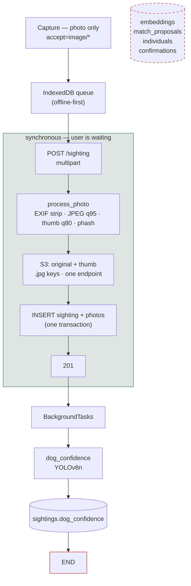
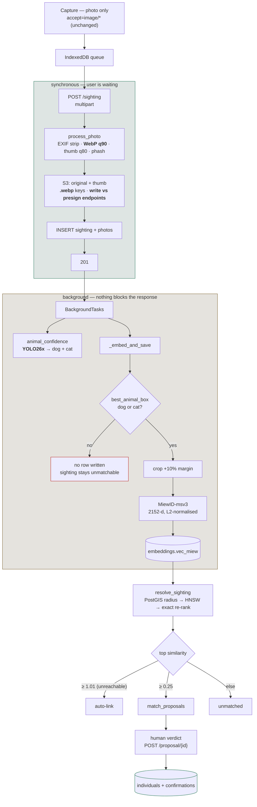

# Capture workflow: before and after re-ID

What one photo upload did at `cf276c4`, what it does now, and why each change
was made. Companion to `AGENTS.md` (which describes the current system only).

---

## Before

The four tables on the right existed from migration `0001`. **No committed code
had ever written a row to any of them.** A photo went in, received a
dog-confidence score, and stopped. There was no embedding, no candidate search,
no notion of an individual animal.

---

## Now

---

## Stage by stage

| Stage | Before | Now | Why |
|---|---|---|---|
| Capture | `accept="image/*"` | **unchanged** | Video is PR #3, unmerged — see below |
| Encode | JPEG q95 / thumb q80 | **WebP q90** / thumb q80 | −0.2 accuracy points, 66% smaller (674 kB vs 2001 kB on a 12 MP capture) |
| S3 keys | `.jpg` | `.webp` | Old objects keep their keys and formats; both coexist |
| S3 endpoint | one | **write vs presign split** | SigV4 signs the Host, so a URL signed for the internal host 403s in a browser |
| Animal gate | YOLOv8n | **YOLO26x**, dog *and* cat | v8n scored a clearly visible dog at 0.021 where 26x gives 0.800 |
| Embedding | none | **MiewID-msv3**, 2152-d, on the animal crop | Whole-frame embeddings match other streets, not other dogs |
| Candidate search | none | PostGIS radius → HNSW → exact re-rank | HNSW caps at 2000 dims; MiewID is 2152, so ANN runs on a `halfvec` cast and the shortlist is re-scored at full precision |
| Identity | none | human verdict only | See thresholds below |
| Basemap | OSM raster | CARTO Positron / Dark Matter | Road-atlas detail competed with the sightings |
| Pins | square | round | Matches the cluster bubbles |

---

## Thresholds, and why nothing merges itself

`reid_auto_merge_min` is **1.01** — deliberately unreachable. Every identity in
the system comes from a person saying "same dog".

That is not caution, it is what the data supports. Measured on 30 sightings of
10 dogs pushed through this API, session-disjoint:

| prior photos of the dog | 1 | 2 | 4 | 8 | 32 | 64 | 4,767 |
|---|---|---|---|---|---|---|---|
| top-1 | 37% | 43% | 67% | 83% | 87% | 87% | 94.9% |

Two things follow:

**94.9% is a dense-gallery number.** It is the research repo's figure over a
47,671-frame gallery. A dog with one prior photo is a ~40% problem. Do not quote
94.9% as what a new contributor will experience.

**d′ stayed flat at ~0.85 across every gallery size** (genuine ≈0.35, impostor
≈0.245). More photos improve *ranking* — the odds that some stored frame of the
right dog is nearest — and never improve *separation*. Proposal precision was
18–36% at every cut-off from 0.20 to 0.50. No amount of collected data rescues a
fixed threshold; only a human looking at a ranked candidate does.

The pipeline is faithful to the offline research path — on identical frames this
API scored **50%** top-1 against the offline path's **46.7%**. Gaps to benchmark
numbers are the gallery, not the service.

---

## Video capture

For a long time there was no video option because PR #3 (`feat/video-capture`)
was never merged — and **it cannot be merged**: that branch was cut before the
repository's history was rewritten, so it shares no common ancestor with `main`
(different root commit, and it carries only migration `0001`). GitHub will never
offer a clean merge for it.

Its two commits are cherry-picked here instead. `app/video.py` decodes a clip
with `imageio` + `imageio-ffmpeg` (a bundled static binary, so the slim
container needs no apt package), subsamples to ~2 fps, runs each frame through
the ordinary `process_photo`, and keeps a phash-diverse subset — up to 12
frames. The clip itself is **never stored**; only the frames it yielded.

The capture screen's half of that branch was discarded rather than merged: it
predates the multi-photo refactor from PR #6 and conflicted in eight places
against a component that no longer exists in that shape. The video option was
rebuilt on the current screen instead, including the offline queue, which now
reads a clip's bytes at capture time exactly as it does for photos — a camera
video File on iOS is the same purgeable handle, only larger.

Measured live on a 2.8 s, 30 fps clip: 201 in 0.7 s, 6 diverse frames stored,
5 embedded (one frame had no animal in it, correctly skipped),
`dog_confidence` 0.969, `attrs.source = "video"`.

**Matching had to change to make video worth anything.** `resolve_sighting`
originally queried with a sighting's *first* embedding, so a six-frame clip
searched with one frame and the other five were dead weight on the query side.
On that live clip the single-frame query ranked the wrong dog first and the
right dog fourth; querying with all six put the right dog first **and** second:

| | top candidate | rank of the true dog |
|---|---|---|
| first frame only | cheetah 0.4158 | 4th (0.3052) |
| max over 6 frames | **luna 0.5401** | **1st and 2nd** |

`find_candidates` now takes every embedding of the query sighting, runs one
indexed ANN probe per frame, and scores each candidate by its best match against
any frame. A candidate is the same animal from a different angle; the question
is "have we seen this dog", not "have we seen this pose".

One correction still outstanding: frame selection uses **phash**, which compares
whole scenes. Two frames of the same dog against the same wall look
near-identical to phash while differing usefully in embedding space. Selecting on
embedding diversity would be better now that the embedder is in-tree. Sampling
the middle 80% of the clip would help too — detection succeeds 93% mid-clip
against ~39% at the edges.

---

## What existing data does on deploy

**Schema migrates itself.** `deploy/entrypoint.sh` runs `alembic upgrade head`
before uvicorn, so `0005` and `0006` apply on the next deploy. pgvector comes
from the `pgvector/pgvector:pg16` image (0.8.6; `halfvec` needs ≥0.7.0). Both
new columns are nullable.

**S3 needs nothing.** Format is per-object and the key lives in `photos.s3_key`.
Existing `.jpg` objects keep serving; only new uploads are `.webp`.

**Nothing backfills.** Every existing photo has no `vec_miew`, and
`find_candidates` filters on `vec_miew IS NOT NULL` — so the existing corpus is
invisible to matching until something re-embeds it. Given that accuracy *is*
gallery density, deploying without a backfill starts the system at the
1-photo-per-dog end of the table above while the photos that would make it work
sit unread in S3.

**`dog_confidence` becomes incomparable across the deploy** — old rows scored by
YOLOv8n, new rows by YOLO26x, and the two disagree substantially (on 29 varied
photos: dogs 14/17 vs 9/17, cats 10/12 vs 1/12). Any filter on that column will
treat two different populations as one.

**A failed migration takes the site down**, not merely un-updated:
`entrypoint.sh` is `set -e`, so a migration error means uvicorn never starts and
the replaced container is already gone. Both new migrations add `CHECK`
constraints, which Postgres validates against existing rows. Both tables should
be empty — no committed code ever wrote them — but `NOT VALID` would remove the
risk entirely.
